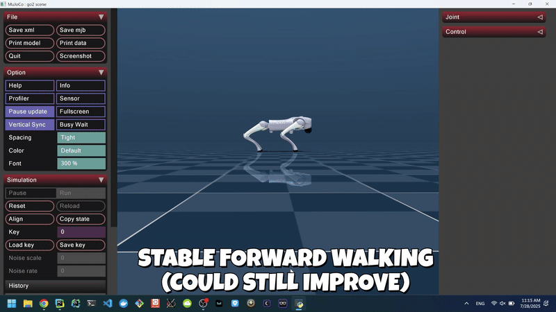
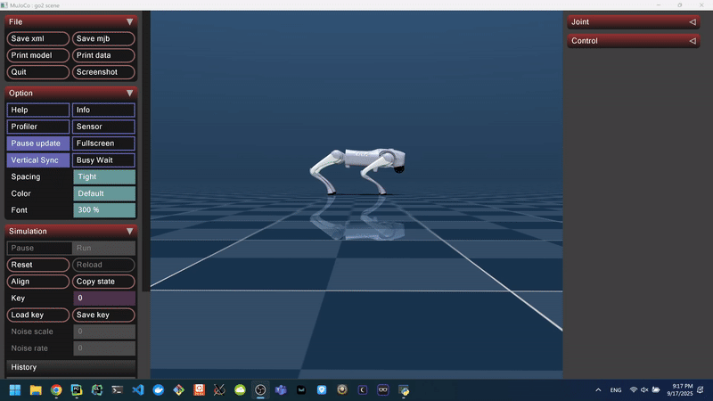

# UT Austin REU Research: Reinforcement Learning for Sim-to-Real Quadruped Locomotion (2025)

## A reinforcement learning (RL) pipeline to train a forward walking policy for the Unitree Go2 quadruped robot.

This project is part of robotics sim-to-real research conducted during a summer REU at the University of Texas at Austin
in the Autonomous Systems Group during summer 2025. It is a reinforcement learning (RL) pipeline to train baseline
non-domain-randomized and domain-randomized forward walking policies for the Unitree Go2 quadruped robot. It also
contains ROS2 scripts for low-level control and hardware deployment tests on the physical Go2 robot.

## Features
- Custom **Gymnasium** environment for RL training: single environment, domain and non-domain-randomized versions.
- Reward shaping for stable forward walking.
- PPO training with **Stable-Baselines3**.
- Domain randomization for robustness (friction, mass, torque, latency, IMU noise, external pushes).
- TensorBoard logging for metrics and debugging.
- Evaluation in the MuJoCo viewer.
- ROS2 scripts for hardware deployment.

## MuJoCo RL Forward Walking Gaits (Non-Domain-Randomized and Domain-Randomized)
**Baseline Non-Domain-Randomized Forward Walking Gait Policy**


**Domain-Randomized Forward Walking Gait Policy**


## Repository Structure
- 'single_env_training/': baseline non-domain-randomized environment and PPO loop.
- 'domain_randomization_env_training/': domain-randomized environment and PPO loop.
- 'vectorized_env_training/': experimental multi-environment setup.
- 'ros2_sim2real/': ROS2 scripts and nodes for Go2 hardware implementation and attempted sim-to-real deployment.
- 'go2_information/': actuator mapping information for the Unitree Go2 quadruped.
- 'mujoco_menagerie/': Unitree models used during training and evaluation.

## Installation
Clone the repo and install dependencies:

```bash
git clone https://github.com/AlejandrooBC/Sim2RealDev.git
cd Sim2RealDev
pip install -r requirements.txt
```

## Training
Baseline Non-Domain-Randomized Policy
```bash
cd single_env_training
python ppo_train_single.py
```

Domain-Randomized Policy
```bash
cd domain_randomization_env_training
python ppo_train_dom_rand.py
```

## Evaluation
Baseline Non-Domain-Randomized Policy
```bash
cd single_env_training
python evaluate_policy_single.py
```

Domain-Randomized Policy
```bash
cd domain_randomization_env_training
python evaluate_policy_dom_rand.py
```

## Results
**Non-domain-randomized policy**: More stable, fewer lateral drifts.

**Domain-randomized policy**: Walked successfully, but sometimes displayed jittery movements, micro-hops, and lateral
drift.

## Paper and Additional Resources
[Paper](https://drive.google.com/file/d/1DVjWZARdVNa7wjRNmxYzRFqj8-DmOTCE/view?usp=drive_link)

## Acknowledgements
Thank you to our mentors **Dr. Christian Ellis**, **Dr. Adam Thorpe**, **Dr. Neel Bhatt**, and **Dr. Ufuk Topcu** 
for their mentorship and guidance throughout the summer.
Thank you to **Greta Brown**, who worked with me this summer.
Thank you to the Autonomous Systems Group at the University of Texas at Austin.
Supported by the National Science Foundation (NSF) and the Army Educational Outreach Program (AEOP).